# SnapFrame 📸

**SnapFrame** is a comprehensive photo studio management system built with the **MERN** stack (MongoDB, Express.js, React, Node.js). It enables both administrators and customers to streamline their operations and booking experiences.

---

## 🔧 Tech Stack

- **Frontend**: React.js, HTML5, CSS3, JavaScript
- **Backend**: Node.js, Express.js
- **Database**: MongoDB (Mongoose ORM)
- **Package Management**: npm
- **Dev Tools**: VS Code, Nodemon, GitHub

---

## 🚀 Key Features

- 🧑‍💻 Admin login and client management
- 📸 Add/view photographer portfolios
- 🧾 Booking services with real-time status updates
- 📬 Feedback system for clients and admins
- 💳 Payment page & history
- 📊 Dashboards for admin insights
- 🔐 User login/registration with secure authentication

---

## 📁 Folder Structure

```
Snap_Frame/
├── client/                     # React frontend
│   ├── node_modules/
│   ├── public/
│   ├── src/
│   ├── package-lock.json
│   └── package.json
│
├── db/                         # Local JSON database files
│   ├── admins.json
│   ├── bookings.json
│   ├── categories.json
│   ├── feedbacks.json
│   ├── portfolios.json
│   ├── services.json
│   └── users.json
│
├── server/                     # Express backend
│   ├── AdminController/
│   ├── Middleware/
│   ├── Model/
│   ├── Route/
│   ├── Upload/
│   ├── UserController/
│   ├── node_modules/
│   ├── db.js
│   ├── index.js
│   ├── package-lock.json
│   └── package.json
│
├── assets/
│   └── screenshots/            # Project screenshots for README
│
├── .gitignore                  # Root .gitignore (for server/global)
├── package-lock.json           # (if exists at root level)
└── README.md                   # Main README for GitHub
```

---

## ⚙️ Getting Started

### ✅ 1. Clone the Repository

```bash
git clone https://github.com/Nagaprasad-77/SnapFrame.git
cd SnapFrame
```

### ✅ 2. Setup the Backend

```bash
cd server
npm install
nodemon index.js
```

### ✅ 3. Setup the Frontend

```bash
cd client
npm install
npm start
```

Now the app should be running at:  
👉 **Frontend**: [http://localhost:3000](http://localhost:3000)  
👉 **Backend**: [http://localhost:5000](http://localhost:5000)

---

## 🧪 Sample Admin Access (For Testing)

> The following admin account can be used for testing the admin portal:

Username: admin@gmail.com
Password: 123

> ⚠️ To modify or create admin users, update the `admins.json` file inside the `db/` folder or insert a new admin record in MongoDB manually.

---

## 📸 Screenshots

### Accepted Booking Request
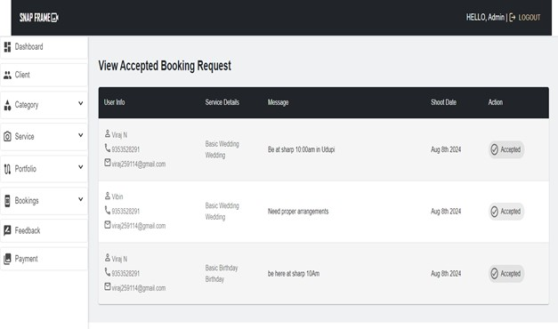

### Add Portfolio
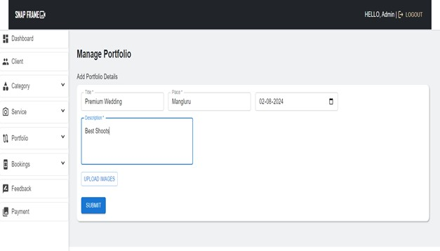

### Add Categories
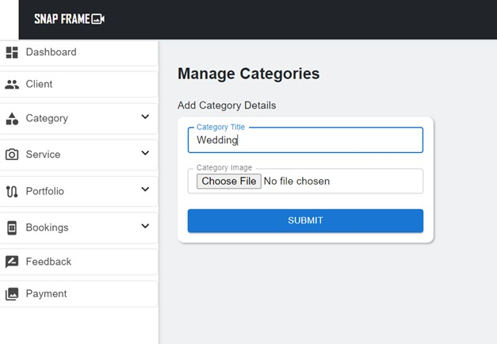

### Admin Dashboard
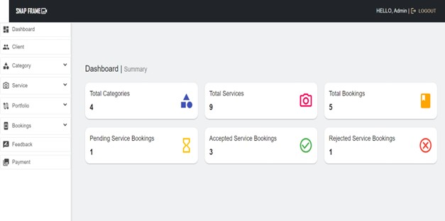

### Admin Login
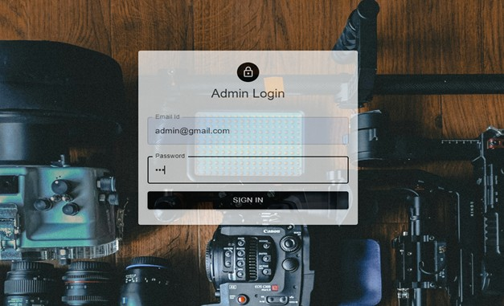

### Booking Request Send
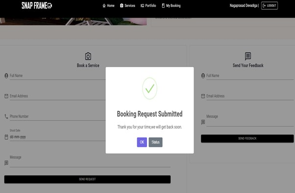

### Booking Service
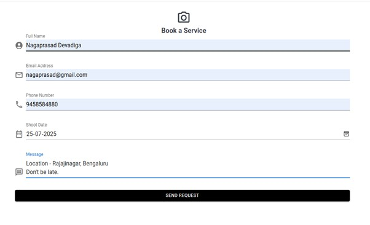

### Booking Status Admin
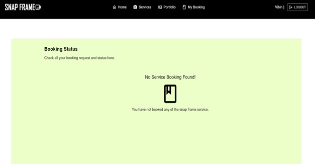

### Booking Status User
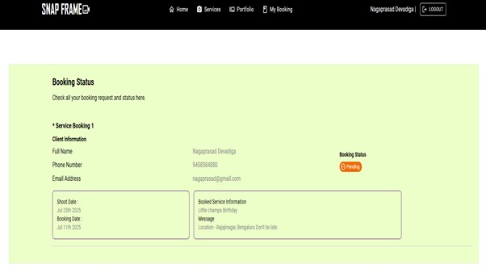

### Declined Booking Request
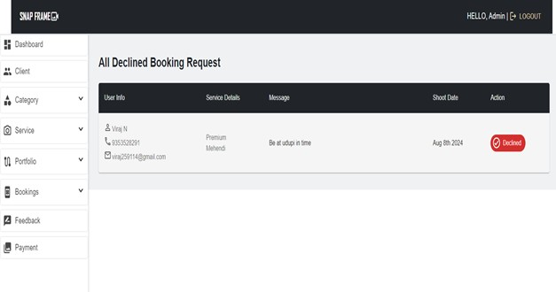

### Feedback Sent
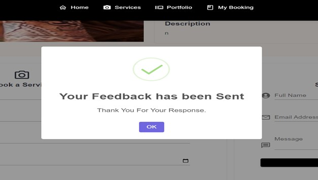

### Feedback User
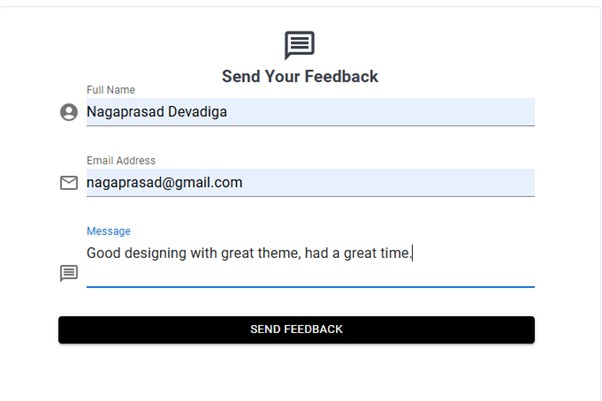

### Feedbacks Admin
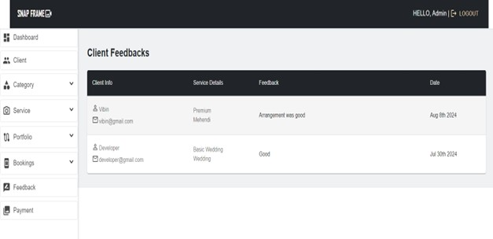

### Home Page
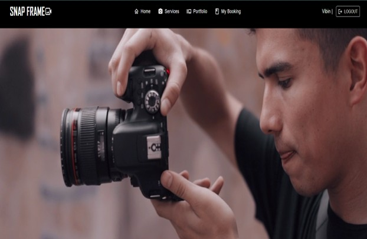

### Manage Client
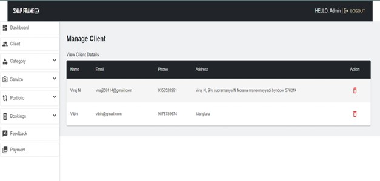

### Payment Page


### Pending Booking Request
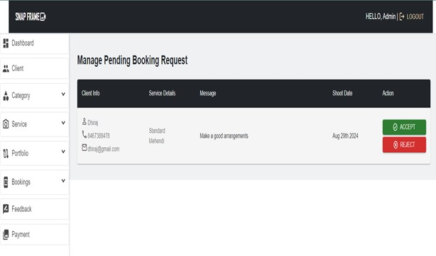

### User Login
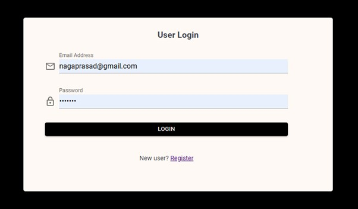

### User Registration
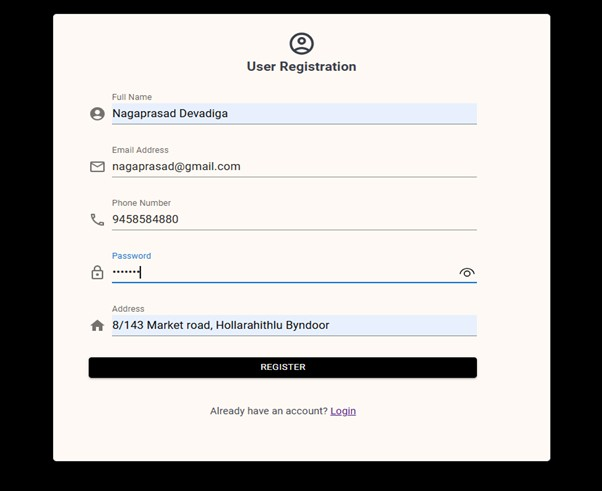

### View Categories
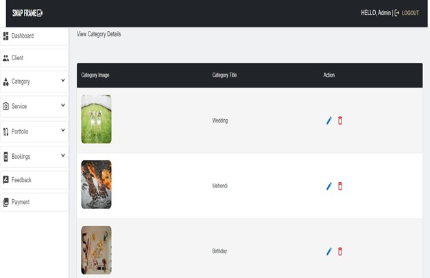

### View Payment Details
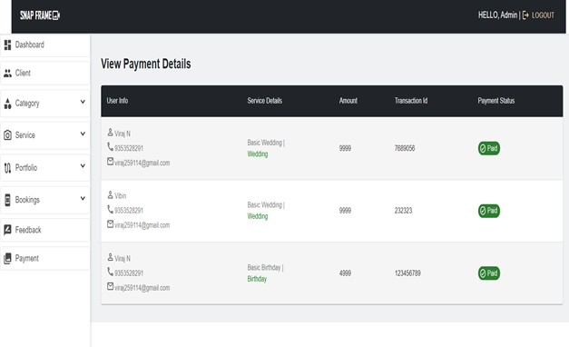

### View Portfolio Admin
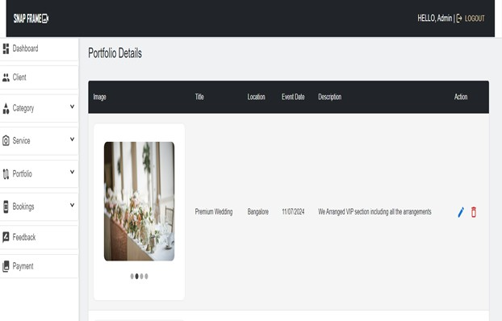

### View Portfolio User


### View Service
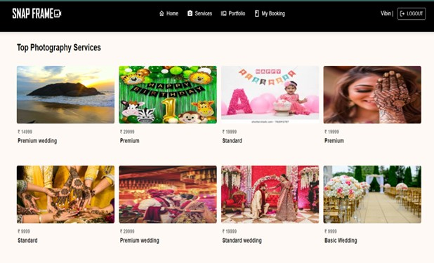


---

## 👨‍💻 Author

**Nagaprasada Devadiga**  
📍 India  
🔗 [GitHub Profile](https://github.com/Nagaprasad-77)

---

## 📜 License

This project is licensed under the **MIT License** — feel free to use and modify.
